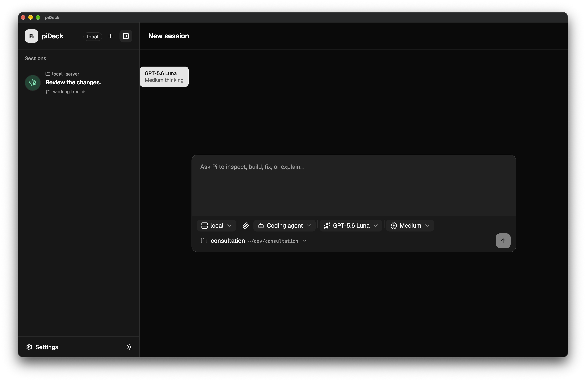

# piDeck

**A desktop control plane for Pi coding agents.**

Run Pi on one machine or scatter it across a small fleet. piDeck gives you one desktop app for starting sessions, watching tool calls, sending follow-ups, and returning to old transcripts without living in a pile of terminals.



```text
┌──────────────────── piDeck desktop ────────────────────┐
│  sessions · prompts · profiles · projects · settings   │
└───────────────┬───────────────────────┬─────────────────┘
                │ HTTP(S) / WebSocket   │
        ┌───────▼────────┐      ┌───────▼────────┐
        │ Pi supervisor  │      │ Pi supervisor  │
        │ workstation    │      │ home server    │
        └───────┬────────┘      └───────┬────────┘
                │                       │
             Pi agents               Pi agents
```

## What you get

- **One inbox for every server.** Sessions from all configured supervisors land in the same sidebar.
- **A proper launch panel.** Pick a server, project, agent profile, model, and thinking level before the first prompt.
- **Live agent telemetry.** Read streamed Markdown, highlighted code, tool activity, lifecycle events, failures, and reconnect state as they happen.
- **Durable conversations.** Runs, events, attachments, and transcripts survive app and supervisor restarts. Finished runs remain open for follow-up chat while their supervisor process is alive.
- **Keyboard-native prompting.** Type `/` for Pi commands and `@` to reference files or directories from the active project.
- **Image input.** Attach PNG, JPEG, GIF, or WebP files directly to a prompt.
- **Fleet-aware settings.** Manage servers, projects, agent profiles, Pi skills, extensions, package updates, and appearance from the app.
- **Local archiving.** Hide stale sessions without deleting their remote history.

## How it works

piDeck has two moving parts:

1. **`pideck-server`** runs beside Pi on each machine where you want agents. It owns process lifecycle, SQLite persistence, event history, and the authenticated HTTP/WebSocket API.
2. **The piDeck desktop app** connects to one or more servers and turns that API into a multi-session workspace.

The Electron renderer never stores server tokens. The main process encrypts them with Electron `safeStorage`, checks requests against configured server origins, and trades authenticated HTTP requests for short-lived, single-use WebSocket tickets. Run admission uses a SQLite partial unique index, so one agent cannot accidentally pick up two queued or running jobs across supervisor processes.

## Run it from source

You need:

- Node.js 22.19+
- pnpm 9.15

Install the workspace and prepare the local database:

```sh
git clone https://github.com/amirrezaask/piDeck.git pideck
cd pideck
pnpm install
cp .env.example .env
pnpm db:migrate
```

Start the supervisor and desktop app in separate terminals:

```sh
pnpm dev:server
```

```sh
pnpm dev:client
```

The development supervisor listens at `http://127.0.0.1:4101`. In piDeck, open **Settings → Servers**, add that address, and use the token from `NEXTFLOW_SUPERVISOR_TOKEN` in `.env`.

To run Pi on another machine, start `pideck-server` there and add its origin and token to the same settings page. Keep the service on loopback unless another host needs access. For network deployments, terminate TLS and enforce host authentication in front of it.

## Development

The repository is a pnpm/Turborepo monorepo:

```text
apps/client          Electron main process and secure preload bridge
apps/web             React 19 renderer, Vite, Tailwind CSS, shadcn/ui
apps/server          pideck-server executable
packages/supervisor  Pi process manager and server API
packages/*           contracts, runtime, database, observability, test agents
```

Useful commands:

```sh
pnpm dev:web          # renderer only at http://127.0.0.1:5173
pnpm dev:server       # supervisor at http://127.0.0.1:4101
pnpm dev:client       # build and open the Electron app

pnpm build
pnpm typecheck
pnpm test
pnpm test:coverage
pnpm test:e2e
pnpm lint
pnpm format:check
```

Vite proxies `/supervisor/*` to the local development server and supplies the development credential. Playwright uses the locally installed Google Chrome channel; install Chrome in CI or switch the project to a bundled Playwright browser.

## Build artifacts

Build a standalone supervisor executable with Bun installed:

```sh
pnpm build:binary
# output: dist/pideck
```

Package the desktop app with Electron Forge:

```sh
pnpm --filter @pideck/client make
```

## Embed the supervisor

`@pideck/supervisor` is also a reusable package:

```ts
import { buildSupervisorApp } from '@pideck/supervisor';

const { server } = buildSupervisorApp({
  databasePath: './data/pideck.sqlite',
  agentDefaultCwd: process.cwd(),
  serviceToken: process.env.NEXTFLOW_SUPERVISOR_TOKEN,
});

await server.listen({ host: '127.0.0.1', port: 4101 });
```

Call `server.close()` during shutdown. The package handles migrations, Pi sessions, run lifecycle, event persistence, paged HTTP history, and bounded WebSocket replay. Event payloads default to 256 KiB, 16 levels of nesting, and 10,000 items. You can set tighter limits through the app options.

Prompts, tool inputs, and model output may contain source code, credentials, or other sensitive data. Treat the SQLite database and Pi session directory like the repositories your agents can access.
