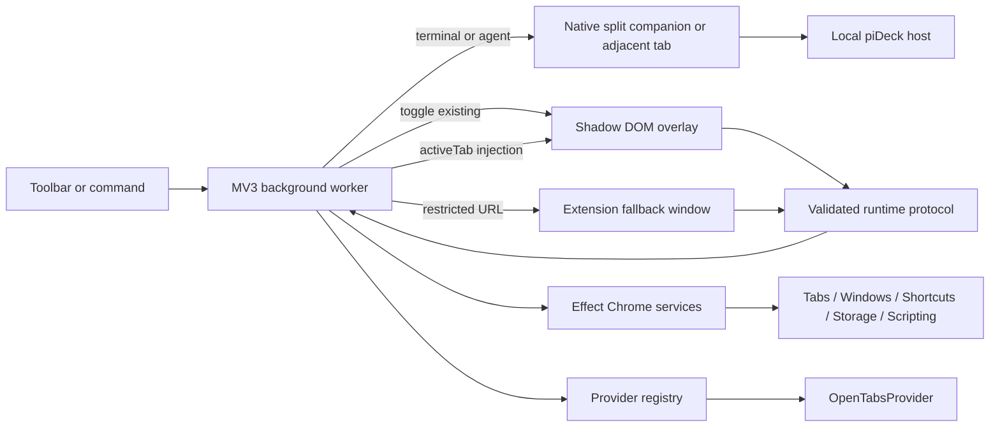

# ChromePlus

ChromePlus is the browser shell for piDeck. It opens terminal and agent surfaces as Chrome tabs and includes Switcher, a keyboard-first palette for finding and managing open tabs across every normal browser window.

## Screenshot

Build and load the extension, open Switcher on a page with several tabs, then capture the centered palette at a 1440×900 browser viewport. Store the approved image at `docs/switcher.png` and add it here as ``.

## Stack

- WXT and Chrome Manifest V3
- React 19, strict TypeScript, Tailwind CSS 4
- shadcn/ui Command primitives and cmdk (`shouldFilter={false}`)
- Effect for Chrome adapters, provider execution, runtime boundaries, typed errors, layers, and cancellation
- Effect Schema for every runtime request and response
- Lucide icons and Motion transitions
- Vitest, React Testing Library, Playwright, Oxlint, and Oxfmt

## Setup

From the repository root:

```sh
pnpm install
pnpm --filter @pideck/switcher dev
```

WXT opens a development Chrome profile and rebuilds the extension as files change.

## Build and load in Chrome

```sh
pnpm --filter @pideck/switcher build
```

The unpacked production extension is written to:

```text
apps/chrome-extension/build/chrome-mv3
```

To load it:

1. Open `chrome://extensions`.
2. Enable **Developer mode**.
3. Choose **Load unpacked**.
4. Select `apps/chrome-extension/build/chrome-mv3`.

Create a release archive with:

```sh
pnpm --filter @pideck/switcher zip
```

Before release, run `pnpm --filter @pideck/switcher check`, inspect the generated manifest, load the unpacked build in stable Chrome, and run the headed extension test on each supported desktop OS.

## Using Switcher

Use these shortcuts:

| Action        | macOS               | Windows/Linux    |
| ------------- | ------------------- | ---------------- |
| Open Switcher | **Command+Shift+K** | **Ctrl+Shift+K** |
| Open terminal | **Command+Shift+J** | **Ctrl+Shift+J** |
| Open agent    | **Command+Shift+A** | **Ctrl+Shift+A** |

Chrome can decline a suggested command or another extension may claim it. Open `chrome://extensions/shortcuts` to assign or change a shortcut. Switcher shows a footer warning and an `!` toolbar badge when its shortcut is unassigned.

### Native Split View

Create a native Chrome Split View from the tab context menu. When you invoke a terminal or agent from one side, ChromePlus loads it in the companion tab. Outside Split View, ChromePlus creates an adjacent tab; place that tab into a split with Chrome’s context menu. Chrome’s extension interface reports Split View membership but cannot create or resize a split.

Search matches tab titles, hostnames, paths, and full URLs. Switcher keeps the result area hidden until you type.

| Key               | Action                      |
| ----------------- | --------------------------- |
| Up / Down         | Move selection              |
| Enter             | Activate selected tab       |
| Shift+Backspace   | Close selected tab          |
| Alt+P             | Pin or unpin selected tab   |
| Alt+M             | Mute or unmute selected tab |
| Home / End        | First or last result        |
| PageUp / PageDown | Move by eight results       |
| Escape            | Dismiss                     |

## Supported and restricted pages

Switcher injects its isolated overlay after explicit invocation on ordinary HTTP and HTTPS pages. It does not register a persistent all-page content script.

Chrome blocks scripting on browser-owned or protected pages such as `chrome://` pages, DevTools, view-source pages, extension management, and the Chrome Web Store. On those pages Switcher opens or focuses one compact extension-owned `switcher.html` window. The fallback uses the same palette component and closes after tab activation.

## Architecture



### Message flow

1. The command and toolbar listeners synchronously register in `entrypoints/background.ts`.
2. Invocation tries a typed `palette/toggle` tab message.
3. If no receiver exists, the worker executes `content-scripts/overlay.js` under the temporary `activeTab` grant.
4. The content entrypoint creates one WXT `createShadowRootUi`, one React root, and one message listener. Subsequent invocations toggle that root.
5. Opening requests one validated bootstrap snapshot. Search is then entirely local.
6. Actions send Effect Schema-validated requests. The background delegates to injected Effect services and returns a validated success or concise error response.

The last invocation tab/window is stored locally so an MV3 worker restart does not break the fallback. No important state relies only on worker memory.

### Provider architecture

`SwitcherProvider` returns an Effect, and the registry currently loads `OpenTabsProvider`. The React palette consumes generic switcher items so a future source can join without replacing palette state or ranking.

### Effect service architecture

Chrome APIs live in adapters behind `ChromeTabs`, `ChromeCommands`, `ChromeStorage`, and `PaletteInjection` services. `makeLiveLayer` wires production implementations once at the background boundary. UI code receives a `PaletteClient`; component tests replace it with deterministic fakes. Runtime requests, provider loads, concurrent bootstrap work, action workflows, storage, and typed errors remain in Effect, while pure normalization and ranking stay ordinary TypeScript.

## Permissions

| Permission  | Purpose                                                                     |
| ----------- | --------------------------------------------------------------------------- |
| `tabs`      | Read tab titles/URLs across windows and activate, close, pin, or mute tabs. |
| `activeTab` | Grant temporary access to the page only after the user invokes Switcher.    |
| `scripting` | Execute the generated runtime overlay bundle after explicit invocation.     |
| `storage`   | Persist theme preference and the fallback invocation context locally.       |

The production manifest has no `host_permissions`, no static `content_scripts`, no `<all_urls>`, and no remotely hosted code. WXT exposes only the generated overlay CSS to the HTTP/HTTPS pages where the runtime UI can mount.

## Search and performance

Searchable fields are normalized once when providers load. Ranking combines exact, prefix, word-boundary, contiguous, and ordered-character matching with hostname weighting, recency decay, current-window affinity, active-tab penalty, and pinned boost. Ordering is deterministic, only the top 50 rows render, and a unit performance test scores 500 synthetic tabs.

## Themes

The footer selects system, light, or dark. Explicit choices persist in `browser.storage.local`; system is the default. Scoped semantic variables and Shadow DOM CSS keep the injected and fallback surfaces visually identical without affecting host-page styles.

## Testing and quality

```sh
pnpm --filter @pideck/switcher format:check
pnpm --filter @pideck/switcher lint
pnpm --filter @pideck/switcher typecheck
pnpm --filter @pideck/switcher test
pnpm --filter @pideck/switcher test:e2e
pnpm --filter @pideck/switcher check
```

Unit tests cover normalization, URL handling, ranking signals, stable limits, restricted URLs, schemas, typed error mapping, and a 500-tab performance tripwire. Component tests cover filtering, focus, navigation, activation, close/pin/mute behavior, mouse action isolation, errors, empty results, favicons, shortcut warnings, themes, and reduced-motion-safe markup. Playwright loads an unpacked MV3 build in a persistent Chromium context and exercises ordinary-page injection, fuzzy search, repeated idempotent toggles, tab activation and management, theme persistence, and restricted-page fallback. Because browser-level extension shortcuts are not dispatched reliably by headless Chromium, the suite uses the validated `test/invoke` request to call the same background application service. The E2E build temporarily grants HTTP/HTTPS origins so `chrome.scripting` can reproduce an `activeTab` grant; the final production build removes those origins.

## Privacy and security

Switcher makes no network requests, includes no analytics or telemetry, and reads no arbitrary page content. It mounts one isolated UI host at body level, treats tab metadata as untrusted React text, validates every message in both directions, and uses neither `eval`, remotely downloaded code, page-world execution, nor `dangerouslySetInnerHTML`.

## Current limitations

- Chrome is the only supported browser for this release.
- Search covers currently open tabs only; bookmarks and history are excluded.
- Chrome owns shortcut assignment, so the suggested shortcut is not guaranteed to be available.
- Browser-protected pages always use the compact fallback window.
- Favicons are displayed only when Chrome provides a usable URL; deterministic letter fallbacks are otherwise shown.

Terminal and agent commands open the local piDeck host at `http://ide.local:7774`. The host remains the authority for PTYs, agent runs, persistence, and authentication. The extension only chooses a Chrome tab and navigates it to the requested surface.
